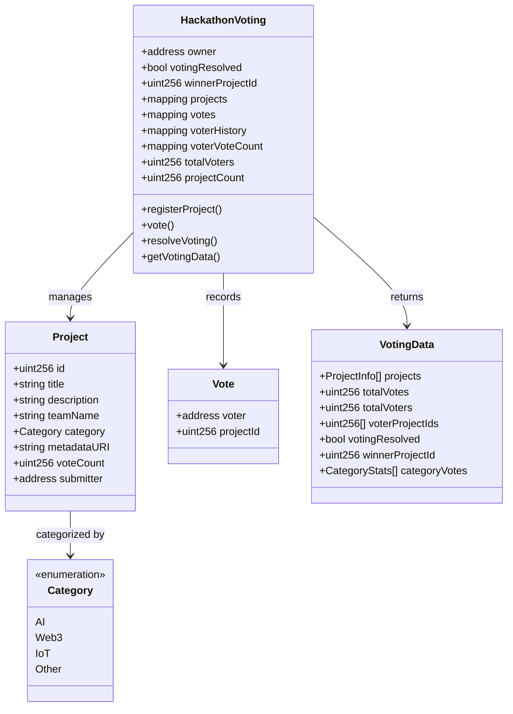
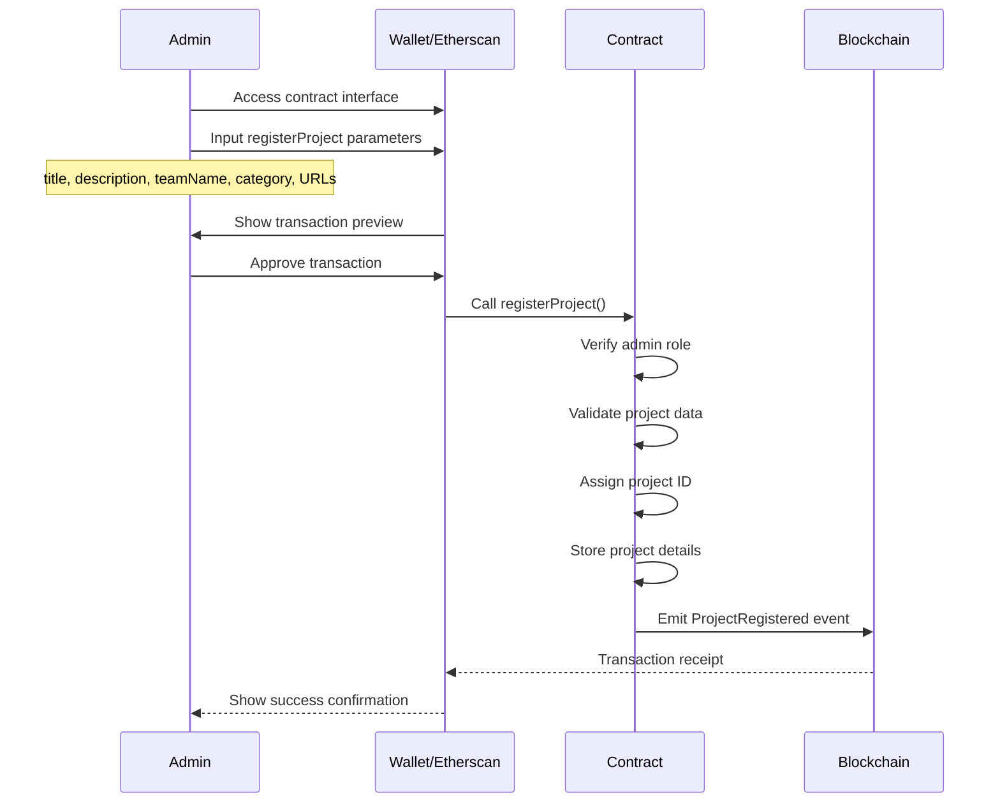
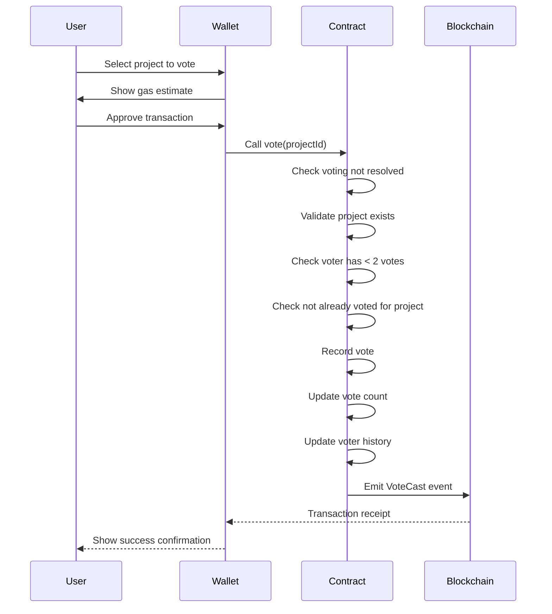
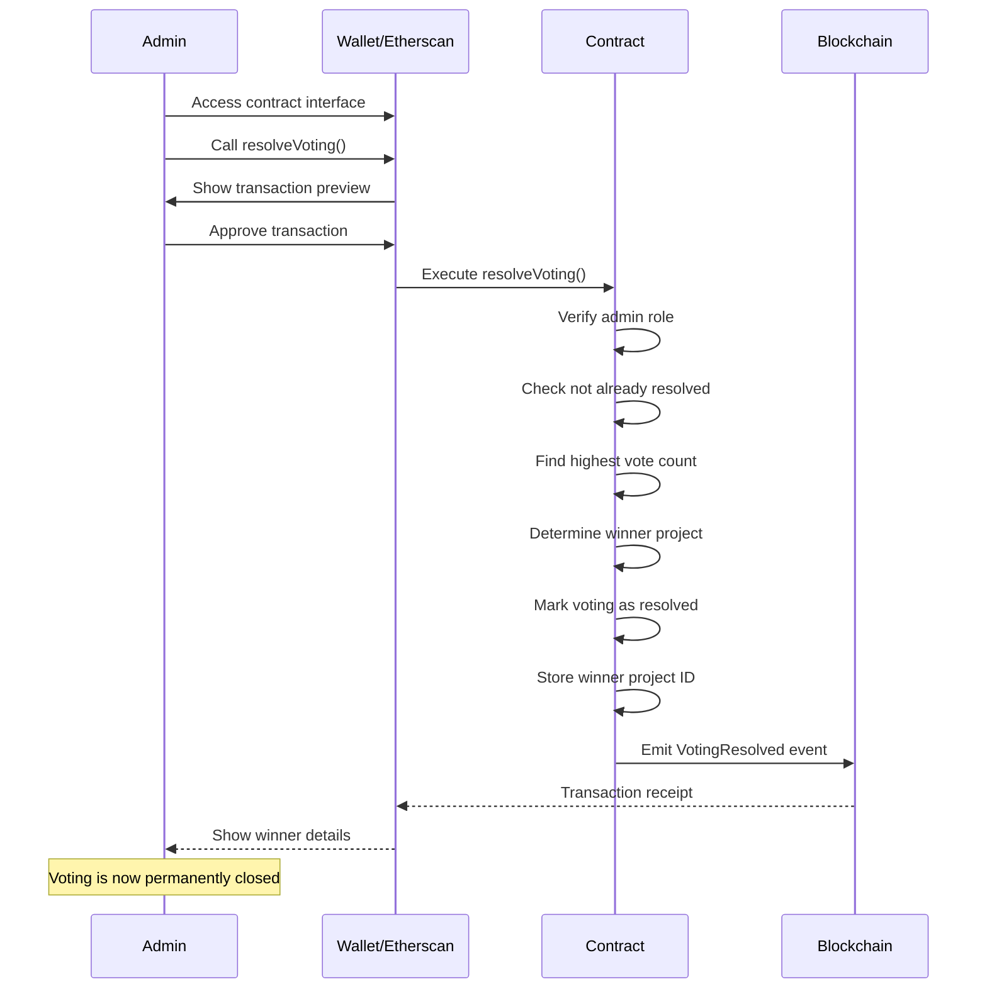
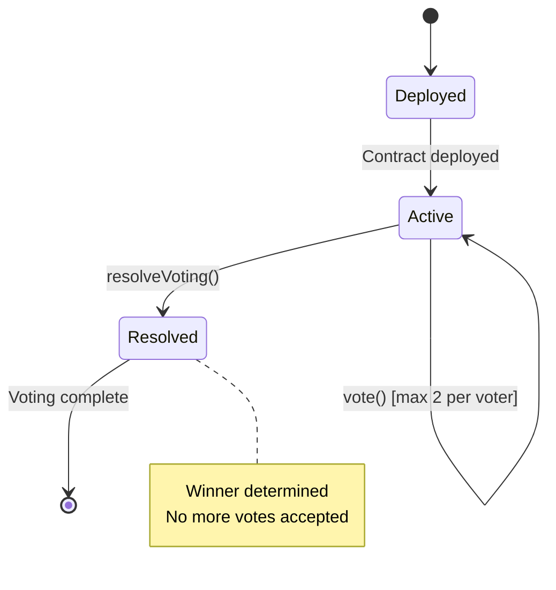

# Smart Contract Technical Specification
## Kesennuma Hackathon Voting System

## 1. Background

### Problem Statement
The current Kesennuma Hackathon voting system relies on centralized infrastructure (Supabase) for data storage and vote management. This creates potential issues with transparency, immutability of votes, and requires trust in a central authority. Moving to a blockchain-based solution would provide a transparent, tamper-proof voting system that aligns with Web3 principles.

### Context / History
- Current system: Next.js web application with Supabase backend
- Features: Project submission, public voting, admin dashboard, email collection for coupons
- Database: PostgreSQL with three main tables (projects, votes, coupon_emails)
- Authentication: Currently no user authentication, IP-based tracking only

### Stakeholders
- **Hackathon Participants**: Teams submitting projects for voting
- **Public Voters**: Community members voting for their favorite projects
- **Hackathon Organizers**: Administrators managing the event and distributing rewards
- **Sponsors**: Organizations providing prizes and coupons based on participation

## 2. Motivation

### Goals & Success Stories

| Goal | Success Criteria |
|------|-----------------|
| Transparent Voting | All votes are publicly verifiable on blockchain |
| Immutable Results | Vote counts cannot be manipulated after submission |
| Decentralized Trust | No single entity controls the voting process |
| Sybil Resistance | Implement mechanisms to prevent vote manipulation |
| Gas Efficiency | Minimize transaction costs for voters |
| User Experience | Maintain simple voting interface similar to current system |

## 3. Scope and Approaches

### Non-Goals

| Technical Functionality | Reasoning for being off scope |
|------------------------|------------------------------|
| Complex governance tokens | Unnecessary complexity for a simple voting event |
| Cross-chain compatibility | Single chain deployment is sufficient for local hackathon |
| On-chain image storage | Too expensive, IPFS or off-chain storage preferred |
| Real-time voting updates | Blockchain confirmations have inherent latency |

### Value Proposition

| Technical Functionality | Value | Tradeoffs |
|------------------------|-------|-----------|
| On-chain voting records | Complete transparency and immutability | Gas costs per vote |
| Two votes per address | More nuanced preference expression | Slightly higher complexity |
| On-chain resolution | Trustless winner determination | Gas cost for resolution |
| Single view function | All frontend data in one call | Larger response payload |
| Gnosis Chain deployment | Low gas costs and fast finality | Smaller ecosystem than Ethereum mainnet |

### Alternative Approaches

| Technical Functionality | Pros | Cons |
|------------------------|------|------|
| Commit-reveal voting | Prevents vote buying and early influence | More complex UX, requires two transactions |
| Snapshot voting (off-chain) | Zero gas costs | Less decentralized, requires trusted infrastructure |
| Token-gated voting | Strong sybil resistance | Requires token distribution mechanism |
| Merkle tree aggregation | Batch vote submission for gas efficiency | More complex implementation |

### Relevant Metrics
- Total unique voters
- Gas costs per vote
- Time to vote finalization
- Number of projects registered
- Contract deployment costs

## 4. Step-by-Step Flow

### 4.1 Main ("Happy") Path

**Project Registration Flow:**
1. **Pre-condition**: Contract deployed with admin privileges set
2. **Actor**: Admin calls `registerProject()` with project details
3. **System** validates:
   - Caller has admin role
   - Project data is valid
4. **System** persists:
   - Project struct with ID, title, description, team, category, URLs
   - Emits `ProjectRegistered` event
5. **Post-condition**: Project available for voting

**Voting Flow:**
1. **Pre-condition**: Projects registered, voting not resolved
2. **Actor**: Voter calls `vote()` with project ID
3. **System** validates:
   - Voting not yet resolved
   - Project exists
   - Voter has not already voted for this project
   - Voter has cast less than 2 total votes
4. **System** persists:
   - Vote record with voter address, project ID
   - Updates project vote count
   - Updates unique voter count if first vote
   - Updates voter's vote history
   - Emits `VoteCast` event
5. **Post-condition**: Vote recorded immutably on chain (max 2 per voter)

**Frontend Data Query Flow:**
1. **Pre-condition**: Contract deployed with projects
2. **Actor**: Frontend calls `getVotingData(address viewer)`
3. **System** returns single struct containing:
   - Array of all projects with complete details and vote counts
   - Total votes across all projects
   - Total number of unique voters
   - Viewer's voting history (which projects they voted for, max 2)
   - Whether voting has been resolved
   - Winner project ID (if resolved)
   - Categories and their vote distributions
4. **Post-condition**: Frontend has all data needed for display in one call

**Vote Resolution Flow:**
1. **Pre-condition**: Admin ready to finalize results
2. **Actor**: Admin calls `resolveVoting()`
3. **System** validates:
   - Caller has admin role
   - Voting not already resolved
   - At least one vote has been cast
4. **System** executes:
   - Determines project with highest vote count
   - Marks voting as resolved
   - Stores winner project ID
   - Emits `VotingResolved` event
5. **Post-condition**: Winner determined and stored on-chain

### 4.2 Alternate / Error Paths

| # | Condition | System Action | Suggested Handling |
|---|-----------|---------------|-------------------|
| A1 | Project doesn't exist | Revert with "ProjectNotFound" | Validate project ID client-side |
| A2 | Voter already voted for this project | Revert with "AlreadyVotedForProject" | Check project vote status |
| A3 | Voter already cast 2 votes | Revert with "MaxVotesReached" | Check vote count before TX |
| A4 | Voting already resolved | Revert with "VotingResolved" | Check resolution status |
| A5 | Insufficient gas | Transaction fails | Estimate gas and warn user |
| A6 | Admin action by non-admin | Revert with "Unauthorized" | Hide admin functions from UI |
| A7 | Resolve with no votes | Revert with "NoVotesCast" | Ensure votes exist before resolution |

## 5. UML Diagrams

### Class Diagram


### Sequence Diagrams

#### Admin Flow: Project Registration (Direct Contract Interaction)


#### User Flow: Voting



#### Admin Flow: Resolving Votes



### State Diagram


## 5. Edge Cases and Concessions

### Edge Cases
1. **Gas price spikes**: Voting might become prohibitively expensive
   - Consider meta-transactions or gas sponsorship
2. **Network congestion**: Votes might be delayed or fail
   - Implement retry logic in frontend
3. **Lost wallet access**: Voters cannot recover their voting history
   - Consider backup verification methods

### Design Concessions
1. **No vote changing**: Once cast, votes are final (simplifies logic)
2. **Public voting**: All votes are transparent (no privacy)
3. **Single chain deployment**: No cross-chain voting support initially
4. **Limited project metadata**: Most data stored off-chain for gas efficiency

## Contract Interface Specification

### Main View Function
The contract provides a single comprehensive view function that returns all data needed by the frontend:

```solidity
struct ProjectInfo {
    uint256 id;
    string title;
    string description;
    string teamName;
    Category category;
    string imageUrl;
    string demoUrl;
    string githubUrl;
    uint256 voteCount;
}

struct CategoryStats {
    Category category;
    uint256 voteCount;
}

struct VotingData {
    ProjectInfo[] projects;        // All projects with complete details
    uint256 totalVotes;            // Sum of all votes across projects
    uint256 totalVoters;           // Count of unique voter addresses
    uint256[] voterProjectIds;     // IDs of projects the viewer voted for (max 2)
    bool votingResolved;           // Whether voting has been finalized
    uint256 winnerProjectId;       // ID of winning project (0 if not resolved)
    CategoryStats[] categoryVotes; // Vote distribution by category
}

function getVotingData(address viewer) external view returns (VotingData memory);
```

**Benefits of Single View Function:**
- Reduces RPC calls from frontend to 1 instead of multiple
- Provides personalized data based on viewer address
- Returns all statistics and metrics in one response
- Simplifies frontend state management
- Reduces latency and improves UX

### Admin Functions
```solidity
function registerProject(
    string memory title,
    string memory description,
    string memory teamName,
    Category category,
    string memory imageUrl,
    string memory demoUrl,
    string memory githubUrl
) external onlyOwner;

function resolveVoting() external onlyOwner;
```

### User Functions
```solidity
function vote(uint256 projectId) external;
function getMyVotes() external view returns (uint256[] memory);
```

## 6. Open Questions

1. **Incentive Mechanism**:
   - Should voters receive participation badges or POAPs?
   - Any rewards for voting participation?

2. **Upgrade Strategy**:
   - Use proxy pattern for upgradability or deploy immutable contract?
   - Consider long-term maintenance needs

3. **Project Metadata Storage**:
   - Store all project data on-chain or use IPFS/off-chain storage?
   - Balance between decentralization and gas costs

## 7. Deployment & Technical Details

### Target Chain: Gnosis Chain
- **Network**: Gnosis Chain (formerly xDai)
- **Benefits**:
  - Low gas costs (typically < $0.01 per transaction)
  - Fast block times (~5 seconds)
  - EVM compatible - same tooling as Ethereum
  - Established ecosystem with block explorers and infrastructure
- **Native Token**: xDAI (stable token pegged to USD)

### Voting Rules
- Each address can vote for up to 2 different projects
- Voters are NOT required to use both votes (can vote for just 1 project)
- Both votes have equal weight (1 vote = 1 vote)
- Cannot vote twice for the same project
- Votes cannot be changed once submitted

## 8. Glossary / References

**Terms:**
- **Gnosis Chain**: EVM-compatible blockchain with low fees and fast finality
- **IPFS**: InterPlanetary File System for decentralized storage
- **xDAI**: Stablecoin native to Gnosis Chain, pegged to USD
- **POAP**: Proof of Attendance Protocol, NFT badges for participation

**References:**
- [Gnosis Chain Documentation](https://docs.gnosischain.com/)
- [OpenZeppelin Contracts](https://docs.openzeppelin.com/contracts)
- [Gnosis Chain Block Explorer](https://gnosisscan.io/)
- Current Implementation: `/scripts/001_create_tables.sql`

**Recommended Smart Contract Architecture:**
- Use OpenZeppelin's `Ownable` for admin management
- Consider `ReentrancyGuard` for vote() function
- Use events extensively for off-chain indexing
- Deploy on Gnosis Chain for low transaction costs