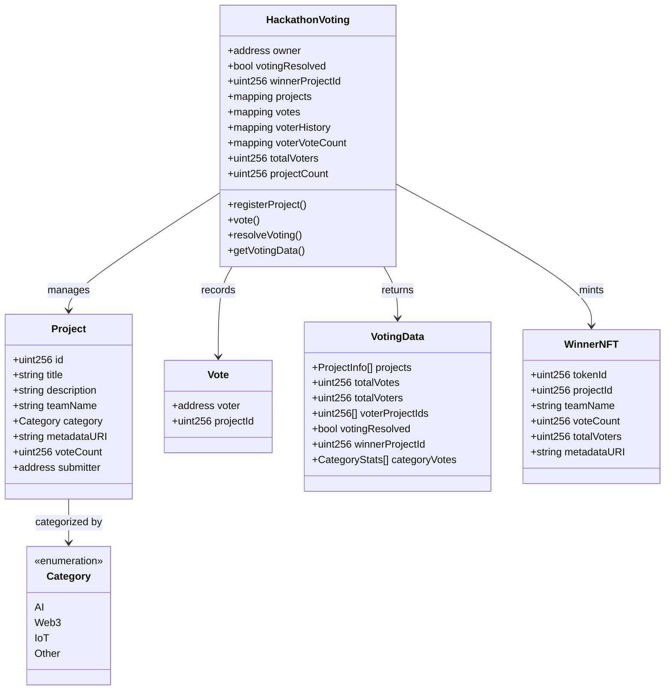
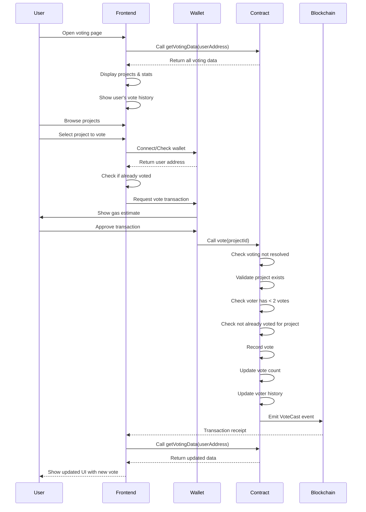
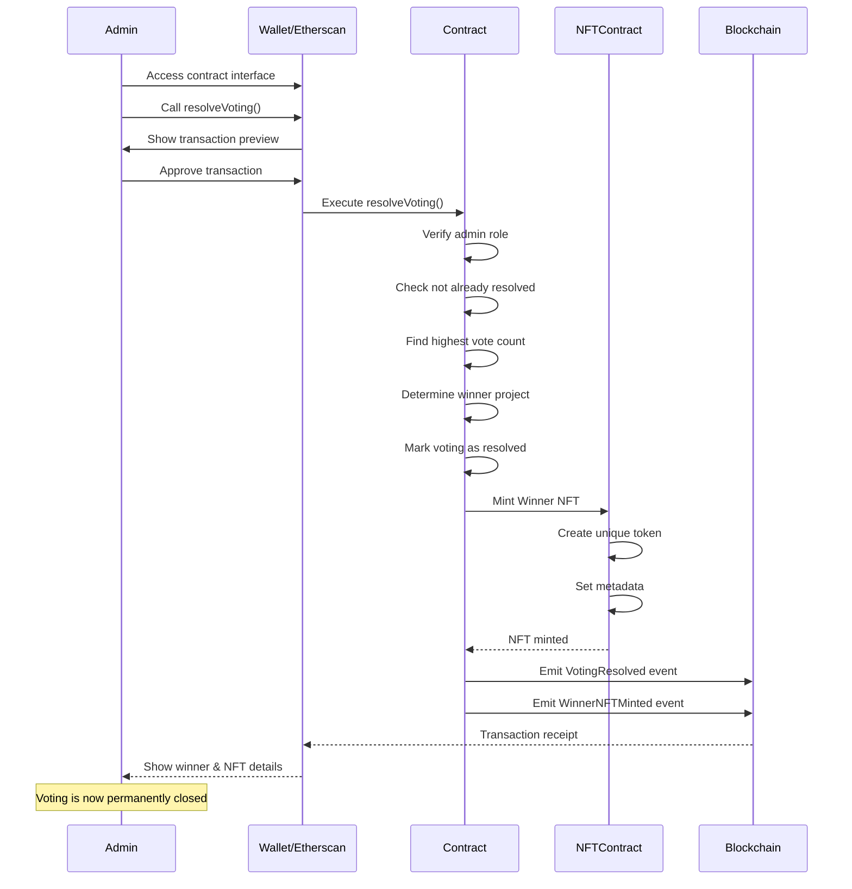

# Smart Contract Technical Specification
## Kesennuma Hackathon Voting System

## 1. Background

### Problem Statement
The current Kesennuma Hackathon voting system relies on centralized infrastructure (Supabase) for data storage and vote management. This creates potential issues with transparency, immutability of votes, and requires trust in a central authority. Moving to a blockchain-based solution would provide a transparent, tamper-proof voting system that aligns with Web3 principles.

### Context / History
- Current system: Next.js web application with Supabase backend
- Features: Project submission, public voting, admin dashboard, email collection for coupons
- Database: PostgreSQL with three main tables (projects, votes, coupon_emails)
- Authentication: Currently no user authentication, IP-based tracking only

### Stakeholders
- **Hackathon Participants**: Teams submitting projects for voting
- **Public Voters**: Community members voting for their favorite projects
- **Hackathon Organizers**: Administrators managing the event and distributing rewards
- **Sponsors**: Organizations providing prizes and coupons based on participation

## 2. Motivation

### Goals & Success Stories

| Goal | Success Criteria |
|------|-----------------|
| Transparent Voting | All votes are publicly verifiable on blockchain |
| Immutable Results | Vote counts cannot be manipulated after submission |
| Decentralized Trust | No single entity controls the voting process |
| Sybil Resistance | Implement mechanisms to prevent vote manipulation |
| Gas Efficiency | Minimize transaction costs for voters |
| User Experience | Maintain simple voting interface similar to current system |

## 3. Scope and Approaches

### Non-Goals

| Technical Functionality | Reasoning for being off scope |
|------------------------|------------------------------|
| Complex governance tokens | Unnecessary complexity for a simple voting event |
| Cross-chain compatibility | Single chain deployment is sufficient for local hackathon |
| On-chain image storage | Too expensive, IPFS or off-chain storage preferred |
| Real-time voting updates | Blockchain confirmations have inherent latency |

### Value Proposition

| Technical Functionality | Value | Tradeoffs |
|------------------------|-------|-----------|
| On-chain voting records | Complete transparency and immutability | Gas costs per vote |
| NFT-based voter badges | Proof of participation and potential future benefits | Minting costs |
| Winner NFT trophy | Permanent on-chain recognition for winning team | One-time minting cost |
| Two votes per address | More nuanced preference expression | Slightly higher complexity |
| On-chain resolution | Trustless winner determination | Gas cost for resolution |
| Single view function | All frontend data in one call | Larger response payload |

### Alternative Approaches

| Technical Functionality | Pros | Cons |
|------------------------|------|------|
| Commit-reveal voting | Prevents vote buying and early influence | More complex UX, requires two transactions |
| Snapshot voting (off-chain) | Zero gas costs | Less decentralized, requires trusted infrastructure |
| Token-gated voting | Strong sybil resistance | Requires token distribution mechanism |
| Merkle tree aggregation | Batch vote submission for gas efficiency | More complex implementation |

### Relevant Metrics
- Total unique voters
- Gas costs per vote
- Time to vote finalization
- Number of projects registered
- Contract deployment costs

## 4. Step-by-Step Flow

### 4.1 Main ("Happy") Path

**Project Registration Flow:**
1. **Pre-condition**: Contract deployed with admin privileges set
2. **Actor**: Admin calls `registerProject()` with project details
3. **System** validates:
   - Caller has admin role
   - Project data is valid
4. **System** persists:
   - Project struct with ID, title, description, team, category, URLs
   - Emits `ProjectRegistered` event
5. **Post-condition**: Project available for voting

**Voting Flow:**
1. **Pre-condition**: Projects registered, voting not resolved
2. **Actor**: Voter calls `vote()` with project ID
3. **System** validates:
   - Voting not yet resolved
   - Project exists
   - Voter has not already voted for this project
   - Voter has cast less than 2 total votes
4. **System** persists:
   - Vote record with voter address, project ID
   - Updates project vote count
   - Updates unique voter count if first vote
   - Updates voter's vote history
   - Emits `VoteCast` event
5. **Post-condition**: Vote recorded immutably on chain (max 2 per voter)

**Frontend Data Query Flow:**
1. **Pre-condition**: Contract deployed with projects
2. **Actor**: Frontend calls `getVotingData(address viewer)`
3. **System** returns single struct containing:
   - Array of all projects with complete details and vote counts
   - Total votes across all projects
   - Total number of unique voters
   - Viewer's voting history (which projects they voted for, max 2)
   - Whether voting has been resolved
   - Winner project ID (if resolved)
   - Categories and their vote distributions
4. **Post-condition**: Frontend has all data needed for display in one call

**Vote Resolution Flow:**
1. **Pre-condition**: Admin ready to finalize results
2. **Actor**: Admin calls `resolveVoting()`
3. **System** validates:
   - Caller has admin role
   - Voting not already resolved
   - At least one vote has been cast
4. **System** executes:
   - Determines project with highest vote count
   - Marks voting as resolved
   - Mints Winner NFT to winning team's address
   - Emits `VotingResolved` event
   - Emits `WinnerNFTMinted` event
5. **Post-condition**: Winner determined and NFT minted

### 4.2 Alternate / Error Paths

| # | Condition | System Action | Suggested Handling |
|---|-----------|---------------|-------------------|
| A1 | Project doesn't exist | Revert with "ProjectNotFound" | Validate project ID client-side |
| A2 | Voter already voted for this project | Revert with "AlreadyVotedForProject" | Check project vote status |
| A3 | Voter already cast 2 votes | Revert with "MaxVotesReached" | Check vote count before TX |
| A4 | Voting already resolved | Revert with "VotingResolved" | Check resolution status |
| A5 | Insufficient gas | Transaction fails | Estimate gas and warn user |
| A6 | Admin action by non-admin | Revert with "Unauthorized" | Hide admin functions from UI |
| A7 | Resolve with no votes | Revert with "NoVotesCast" | Ensure votes exist before resolution |
| A8 | Tie in vote count | Use first registered project | Document tiebreaker rules |

## 5. UML Diagrams

### Class Diagram


### Sequence Diagrams

#### Admin Flow: Project Registration (Direct Contract Interaction)


#### User Flow: Voting



#### Admin Flow: Resolving Votes and Minting Winner NFT



### State Diagram


## 5. Edge Cases and Concessions

### Edge Cases
1. **Gas price spikes**: Voting might become prohibitively expensive
   - Consider meta-transactions or gas sponsorship
2. **Network congestion**: Votes might be delayed or fail
   - Implement retry logic in frontend
3. **Lost wallet access**: Voters cannot recover their voting history
   - Consider backup verification methods

### Design Concessions
1. **No vote changing**: Once cast, votes are final (simplifies logic)
2. **Public voting**: All votes are transparent (no privacy)
3. **Single chain deployment**: No cross-chain voting support initially
4. **Limited project metadata**: Most data stored off-chain for gas efficiency

## Contract Interface Specification

### Main View Function
The contract provides a single comprehensive view function that returns all data needed by the frontend:

```solidity
struct ProjectInfo {
    uint256 id;
    string title;
    string description;
    string teamName;
    Category category;
    string imageUrl;
    string demoUrl;
    string githubUrl;
    uint256 voteCount;
}

struct CategoryStats {
    Category category;
    uint256 voteCount;
}

struct VotingData {
    ProjectInfo[] projects;        // All projects with complete details
    uint256 totalVotes;            // Sum of all votes across projects
    uint256 totalVoters;           // Count of unique voter addresses
    uint256[] voterProjectIds;     // IDs of projects the viewer voted for (max 2)
    bool votingResolved;           // Whether voting has been finalized
    uint256 winnerProjectId;       // ID of winning project (0 if not resolved)
    CategoryStats[] categoryVotes; // Vote distribution by category
}

struct WinnerNFTData {
    uint256 tokenId;
    uint256 projectId;
    string teamName;
    uint256 finalVoteCount;
    uint256 totalVoters;
    string metadataURI;
}

function getVotingData(address viewer) external view returns (VotingData memory);
function getWinnerNFT() external view returns (WinnerNFTData memory);
```

**Benefits of Single View Function:**
- Reduces RPC calls from frontend to 1 instead of multiple
- Provides personalized data based on viewer address
- Returns all statistics and metrics in one response
- Simplifies frontend state management
- Reduces latency and improves UX

### Admin Functions
```solidity
function registerProject(
    string memory title,
    string memory description,
    string memory teamName,
    Category category,
    string memory imageUrl,
    string memory demoUrl,
    string memory githubUrl
) external onlyOwner;

function resolveVoting() external onlyOwner;
```

### User Functions
```solidity
function vote(uint256 projectId) external;
function getMyVotes() external view returns (uint256[] memory);
```

## 6. Open Questions

1. **Sybil Resistance Strategy**: 
   - Should we implement proof-of-humanity, token-gating, or accept some level of manipulation?
   - With 2 votes per address, sybil attacks become more impactful

2. **Winner NFT Details**:
   - Should the NFT be transferable or soulbound?
   - What metadata should be stored on-chain vs off-chain?
   - Should team members each get an NFT or just one for the team?

3. **Tiebreaker Rules**:
   - If multiple projects have the same highest vote count, how to determine winner?
   - Current approach: first registered wins. Alternative: admin selection?

4. **Incentive Mechanism**:
   - Should voters receive participation NFT badges?
   - Could implement a POAP for voters

5. **Chain Selection**:
   - Ethereum L2 (Arbitrum/Optimism), Polygon, or local chain?
   - Consider gas costs for voting and NFT minting

6. **Vote Distribution Strategy**:
   - Should voters be required to use both votes or can they use just one?
   - Should both votes have equal weight?

## 7. Glossary / References

**Terms:**
- **Sybil Attack**: Creating multiple fake identities to manipulate voting
- **Quadratic Voting**: Voting system where cost of additional votes increases quadratically
- **Meta-transactions**: Transactions where gas is paid by a relayer, not the user
- **IPFS**: InterPlanetary File System for decentralized storage
- **NFT Badge**: Non-fungible token serving as proof of participation

**References:**
- [OpenZeppelin Contracts](https://docs.openzeppelin.com/contracts)
- [Snapshot Voting](https://docs.snapshot.org/)
- [Quadratic Voting Explained](https://vitalik.ca/general/2019/12/07/quadratic.html)
- [EIP-712: Typed Data Signing](https://eips.ethereum.org/EIPS/eip-712)
- Current Implementation: `/scripts/001_create_tables.sql`

**Recommended Smart Contract Architecture:**
- Use OpenZeppelin's `AccessControl` for role management
- Implement `Pausable` for emergency stops
- Consider `ReentrancyGuard` for vote() function
- Use events extensively for off-chain indexing
- Implement EIP-712 for gasless voting (optional)